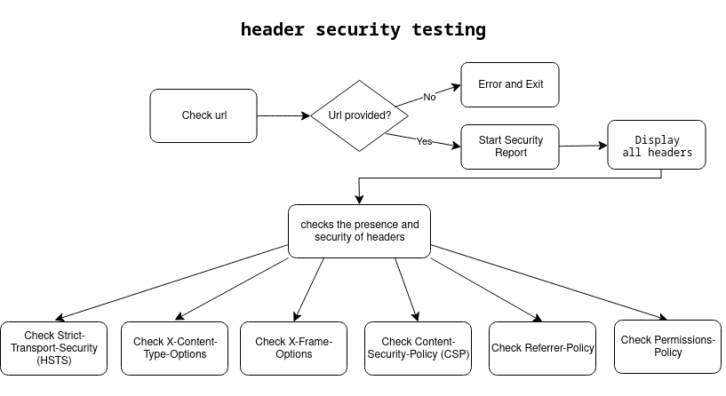
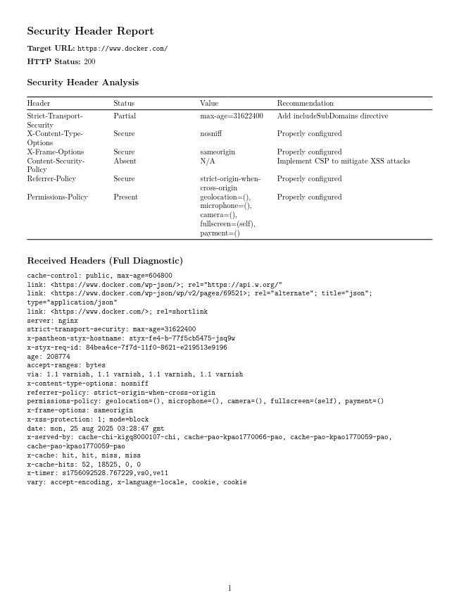

# security-test

### **Header Security Test Automation**

A solution focused on evaluating the implementation and integrity of web headers, providing clear and accessible documentation for both technical professionals and non-technical stakeholders.



### **Model**

The report presents the analysis in two main sections:
1. Header Analysis Summary: The summary is presented in a table format to provide an immediate diagnostic overview of the status, values ​​of key headers, and security best practice recommendations.

2. Detailed Diagnostics (Log): A detailed log section, providing complete context so developers can investigate issues, perform debugging, and ensure that fixes are implemented accurately.



### **Structure**

```shell
    $ tree
    .
    ├── .github/
    │    └── workflows/
    │        └── security-headers-test.yaml
    ├── support
    └── header-security-check.sh
```

* **.github/workflows/:** It will automatically fire on push and pull request events. The pipeline checks the code, runs the `header-security-check.sh` script at the specified URL and generates a PDF report inside a Docker container using a LaTex image for better formatting.

* **support/:** Directory for support files

* **header-security-check.sh:** Executable script responsible for performing security checks on HTTP headers